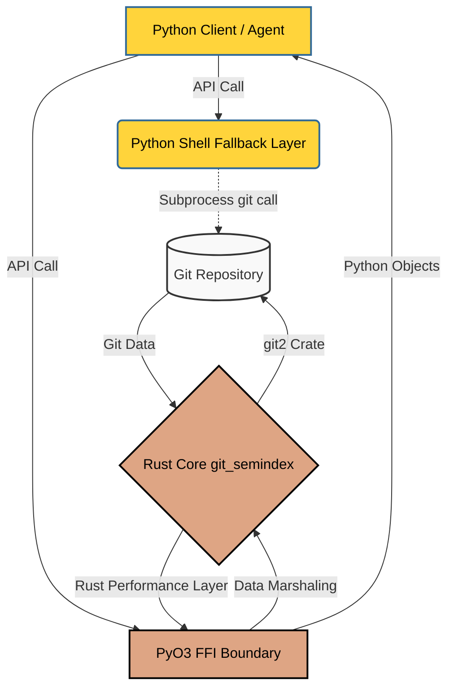

# git-semindex


## Executive Summary

**Problem:** Traditional git operations rely on mechanical, line-by-line textual merging. This fragile approach often obscures the broader intent behind changes, causing context loss and merge conflicts when branches diverge significantly, particularly in AI-assisted workflows with context window constraints.

**Solution:** `git-semindex` introduces a paradigm of **Semantic Extraction over Textual Merging**. It utilizes a highly-optimized Map-Reduce protocol across branch histories to extract metadata and index the *semantic intent* of code changes, completely abstracting away textual noise.

**Core Value Proposition:** A high-performance Rust/Python library designed specifically for agentic workflows. By surfacing semantic intent rather than just diffs, it enables robust "lost code" recovery, intelligent PR consolidation, and massive branch history analysis without exceeding AI context windows.

## The "Getting Started" Protocol

### Prerequisites

To leverage the two-tier architecture (Python API with a Rust core), ensure you have the following installed:
- **Runtimes:**
  - **Python 3.10+** (Required for modern type hinting support).
  - **Rust 1.70+** (Stable toolchain).
- **Tooling:**
  - `maturin` (for building the Python/Rust bindings).
  - Up-to-date pip (`pip install --upgrade pip`).

> **Pro-Tip for Mobile/Termux Users:**
> When building on constrained systems like Android via Termux, ensure you have the necessary build tools:
> ```bash
> pkg install build-essential python-dev pkg-config
> ```

### Installation

Clone the repository and build the mixed-language bindings via `maturin`:

```bash
# 1. Clone the repository
git clone https://github.com/{{OWNER}}/{{REPO}}.git
cd {{REPO}}

# 2. Set up a virtual environment
python3 -m venv venv
source venv/bin/activate

# 3. Upgrade pip and install maturin
pip install --upgrade pip maturin

# 4. Build and install the package in development mode
maturin develop
```

### Usage: Quick Start

Here is a common API call to index a repository and extract semantic intent:

```python
import git_semindex

# Initialize the indexer on a local git repository
indexer = git_semindex.Indexer(repo_path=".")

# Run semantic extraction over the main branch
results = indexer.extract_semantics(branch="main")

print(f"Indexed {results.commit_count} commits.")
print(f"Semantic Summary: {results.summary}")
```

## Architectural Context

`git-semindex` relies on a **Two-Tier Execution Architecture** to ensure blisteringly fast execution under normal conditions and guaranteed reliability as a fallback.

The primary path utilizes a native Rust core (`git_semindex._git_semindex`), leveraging the powerful `git2` crate for unparalleled speed. When Python makes an API call, data is marshaled across the Foreign Function Interface (FFI) boundary via `pyo3`. This guarantees maximum performance for heavy operations like historical mapping. If the C-extension is unavailable, it gracefully falls back to a subprocess shell invoking the standard `git` binary.

### System Data Flow



### Key Dependencies
- **`git2` (Rust):** Chosen for unparalleled, native-speed git operations and granular control over repository data.
- **`pyo3` (Rust/Python):** The bridge that allows Rust's performance to be easily accessible from Python without writing boilerplate C code.
- **`maturin` (Tooling):** Selected for its zero-configuration ability to build and publish Rust-based Python packages.

## Troubleshooting & FAQ

Below are common build-time friction points and their resolutions.

### 1. Missing Linker Configurations or Missing Python Interpreter
**Check:** Maturin fails to build the Rust core, often complaining about a missing Python interpreter or linker errors.
**Action:** Ensure you are running `maturin develop` *inside* an active Python virtual environment (`source venv/bin/activate`). Maturin relies on the active environment to find the correct Python headers and linker paths.

### 2. C-Binding Errors on ARM/Android (Termux)
**Check:** The build fails with `gcc` or `clang` errors stating it cannot find `Python.h` or `libgit2` dependencies on non-x86 architectures.
**Action:** Install required system-level dependencies. In Termux, run `pkg install build-essential python-dev pkg-config`. Ensure your Rust toolchain is configured for the correct target architecture.

### 3. Rust Compiler Missing
**Check:** Error indicating `cargo` or `rustc` is not found.
**Action:** Install the stable Rust toolchain via rustup: `curl --proto '=https' --tlsv1.2 -sSf https://sh.rustup.rs | sh`.

## Contribution & Best Practices

We welcome contributions! To ensure a smooth process and high-quality codebase, we adhere to the **Credon/Squad protocol**.

### The Jules Protocol
This repository leverages agentic workflows for PR management.
- **Agentic Review:** All Pull Requests will be reviewed and potentially augmented by **Jules**, our Developer Experience Agent.
- **CI Validation:** Manual merges to `main` are strictly prohibited unless a successful CI pipeline pass has been achieved.

### Branching Strategy
- **Protected Main:** The `main` branch is protected and always reflects production-ready state.
- **Feature Branches:** All work must happen in dedicated branches prefixed with `feature/` or `bugfix/` (e.g., `feature/improve-extraction`, `bugfix/fix-linker-issue`).

### Commit Style
**Conventional Commits** are mandatory. This allows for automated semantic versioning and changelog generation.
Format your commit messages as follows:
- `feat: add new map-reduce capability`
- `fix: resolve pyo3 memory leak`
- `refactor: optimize git2 bindings`
- `docs: update troubleshooting guide`
